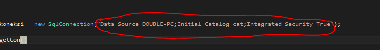
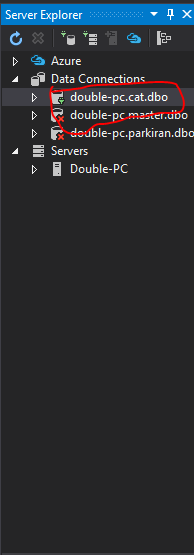
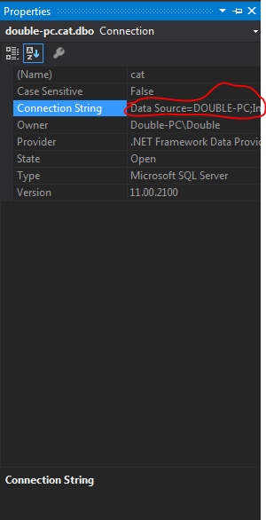

# GOCAT :joy_cat:

### Konfigurasi Project
Buka DAL -> DBConnection.cs ,koneksi string ganti wekmu 

Nek server explorer klik database e , klik properties

Cara nggolek i ne ngeten , koneksine string e gentien karo iki

### Author 
[Salsabiela Cahyahaq](https://github.com/salsabielac) 
